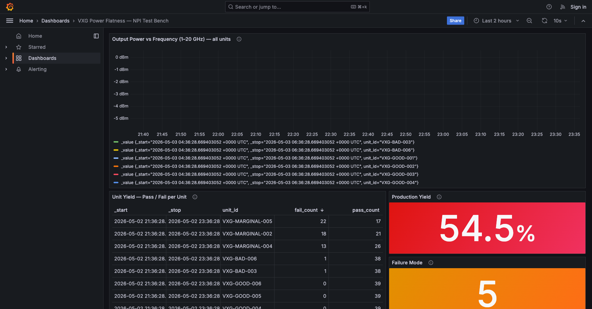

# Virtual Keysight M9484C VXG Test Bench

A simulated Keysight M9484C VXG signal generator with an OpenTAP plugin running
an Output Power Flatness sweep across multiple "units under test." Live results
stream to a public Grafana dashboard.

**Live dashboard:** https://vxg-test-bench.fly.dev/d/vxg-npi/vxg-power-flatness-e28094-npi-test-bench



## What it does

- Simulates the M9484C VXG over real SCPI/TCP (port 5025), with deterministic,
  config-driven defect injection per "unit."
- Runs an Output Power Flatness sweep as a real OpenTAP `TestStep`, against a
  real OpenTAP `Instrument`, with a real OpenTAP `ResultListener` that pushes
  to InfluxDB.
- Streams results to a Grafana dashboard with three panels: power vs
  frequency, per-unit pass/fail, and run history.

## Architecture

```
configs/unit-*.json
        │
        ▼
  Simulator (TCP :5025, SCPI)
        ▲
        │
  OpenTAP TestPlan
  ├─ VxgInstrument         (Instrument)
  ├─ PowerFlatnessSweep    (TestStep)
  └─ InfluxDbResultListener (ResultListener)
        │
        ▼
  InfluxDB ──► Grafana (Fly.io, public)
```

## Run locally

Prerequisites: `dotnet`, `tap` (OpenTAP CLI), `docker`.

```
make demo
```

This builds, starts a local InfluxDB + Grafana via docker-compose, and runs
the full sweep against three simulated units. Dashboard at
http://localhost:3000.

## Repo layout

- `src/VirtualVxg.Simulator/` — C# .NET 10 SCPI simulator
- `src/VirtualVxg.OpenTapPlugin/` — OpenTAP plugin (Instrument + TestStep + ResultListener)
- `tests/VirtualVxg.Tests/` — xUnit tests, all behavior-through-public-interface
- `plans/flatness-sweep.TapPlan` — hand-edited OpenTAP plan
- `deploy/` — Fly.io + Grafana provisioning
- `docs/specs/` — design spec
- `docs/plans/` — TDD implementation plan
